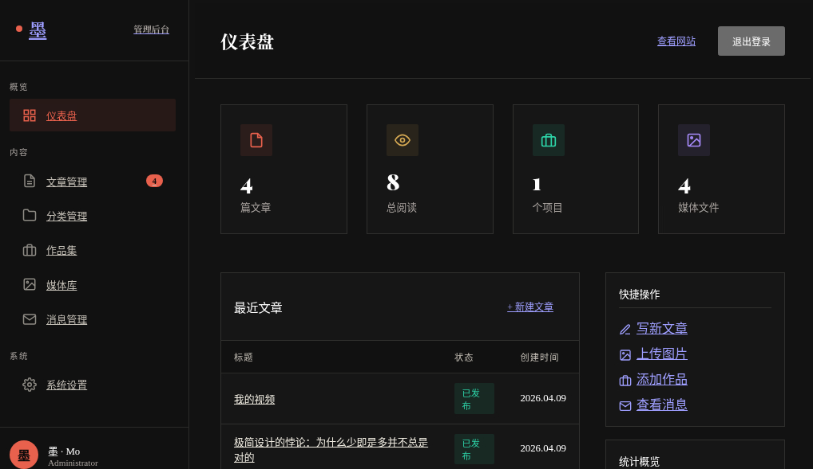
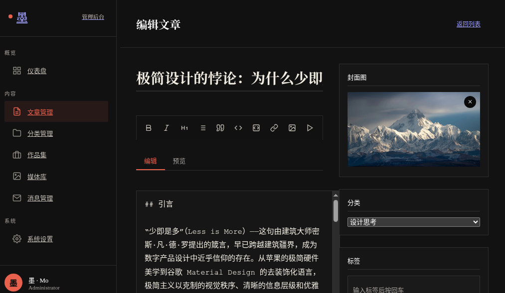
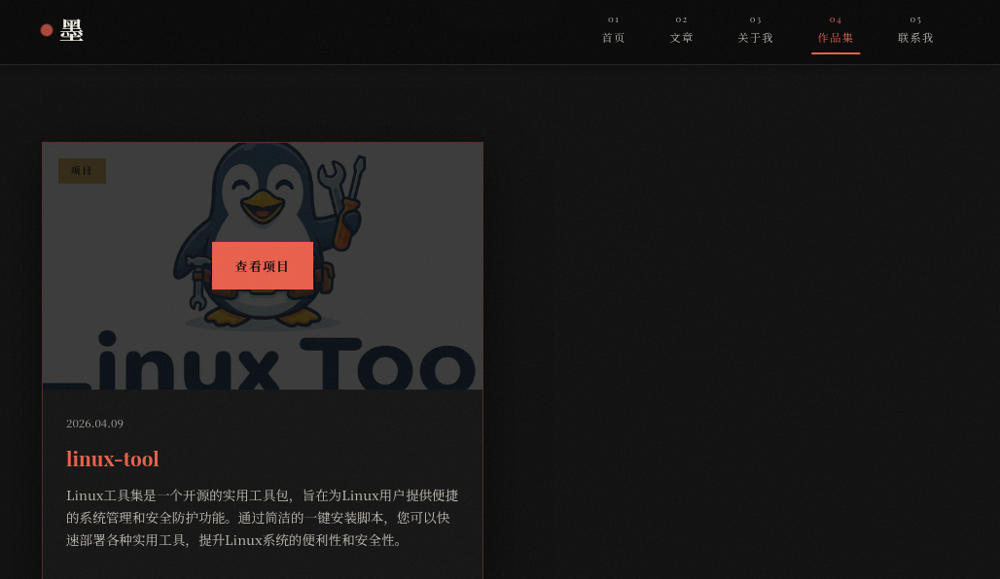

<h1 align="center">墨 · 创意博客</h1>

<p align="center">
  
</p>

<p align="center">
  <b>Mo Blog</b> — 轻量、优雅、功能完备的个人博客系统
</p>


<p align="center">
  
  
  
  
  
</p>


---

## 截图预览


| 前台首页 | 后台仪表盘 |
|:---:|:---:|
|  |  |

| 文章编辑 | 作品集 |
|:---:|:---:|
|  |  |


## GIF 预览


---

## 功能特性

### 前台展示

- **文章系统** — Markdown 渲染、代码高亮、分类与标签筛选、阅读量统计
- **作品集** — 卡片式项目展示，支持封面图、描述和标签
- **联系表单** — 访客留言，防垃圾提交（频率限制 + 蜜罐字段）
- **邮件通知** — 新消息自动发送邮件提醒管理员
- **RSS 订阅** — 自动生成 RSS 2.0 和 Atom 1.0 订阅源
- **视频嵌入** — 支持 YouTube、Bilibili、MP4 视频播放
- **响应式设计** — 适配桌面端与移动端
- **ICP 备案** — 页脚支持备案号展示（含超链接和盾牌图标）
- **Favicon** — 自定义网站图标，书签和标签页可见

### 后台管理

- **仪表盘** — 文章、分类、作品集、消息数据统计概览
- **文章管理** — 创建、编辑、发布、删除文章（Markdown 编辑器 + 工具栏）
- **分类管理** — 分类增删改查，颜色联动标签按钮背景色
- **作品集管理** — 作品展示的增删改查与排序
- **媒体库** — 文件管理器风格，支持图片/视频/PDF，拖拽上传，搜索筛选，重命名
- **消息管理** — 查看和管理联系表单消息，标记已读/未读
- **系统设置** — 站点信息、作者资料、社交链接、Favicon、备案设置、页脚文字
- **邮件服务** — SMTP 配置，支持 QQ/163/Gmail 等邮箱
- **账号安全** — JWT 认证、修改密码、修改用户名
- **头像裁剪** — Cropper.js 实时裁剪，导出 512×512 JPEG

---

## 技术栈

| 层级 | 技术 | 说明 |
|:---|:---|:---|
| 运行时 | Node.js >= 18 | 服务端运行环境 |
| Web 框架 | Express 4.x | 路由、中间件、HTTP 服务 |
| 数据库 | SQLite (better-sqlite3) | 轻量级嵌入式数据库，零配置 |
| 图片处理 | Sharp | 图片裁剪、压缩、缩略图生成 |
| 文件上传 | Multer | multipart/form-data 处理 |
| 邮件发送 | Nodemailer | SMTP 邮件通知 |
| 认证 | JWT (jsonwebtoken) | 无状态 Token 认证 |
| 安全 | bcryptjs + express-rate-limit | 密码加密 + 接口限流 |
| Markdown | marked | Markdown 渲染为 HTML |
| 前端 | 原生 HTML / CSS / JavaScript | 无框架依赖，轻量高效 |

---

## 快速开始

### 🌐 一键在线安装（推荐）

在 Linux 服务器上一行命令即可完成安装和启动：

```bash
bash <(curl -fsSL https://raw.githubusercontent.com/Xynrin/Mo-blog-project/main/install.sh)
```

脚本会交互式引导你配置端口、管理员账号和密码，然后自动完成全部安装。

### 🚀 本地一键部署

```bash
# 下载项目后
bash setup.sh

# 或指定端口
bash setup.sh --port 8080
```

### 手动安装

#### 环境要求

- **Node.js** >= 18.0.0
- **npm** >= 9.0.0
- **编译环境**：`better-sqlite3` 和 `sharp` 需要编译原生模块
  - **Windows**：安装 [Visual Studio Build Tools](https://visualstudio.microsoft.com/visual-cpp-build-tools/)
  - **macOS**：`xcode-select --install`
  - **Linux (Ubuntu/Debian)**：`sudo apt install python3 make g++`

#### 安装与运行

```bash
# 1. 克隆项目
git clone https://github.com/Xynrin/Mo-blog-project.git
cd Mo-blog-project

# 2. 安装依赖
npm install

# 3. 配置环境变量
cp .env.example .env
# 编辑 .env 文件，修改 JWT_SECRET 和管理员密码

# 4. 启动服务
npm start

# 5. 访问
# 前台首页：http://localhost:3000
# 后台管理：http://localhost:3000/admin
```

> 默认管理员账号：`admin` / `admin123`（首次登录后请立即修改）

### 开发模式

```bash
npm run dev    # 使用 nodemon 热重载
```

---

## 项目结构

```
mo-blog/
│ 
├── assets/                 # readme资源
│   ├── image/              # 图片
│   └── gif/                # gif文件
│   
├── server/                  # 服务端代码
│   ├── app.js              # Express 应用入口
│   ├── database.js         # 数据库初始化与表结构
│   ├── middleware/          # 中间件
│   │   ├── auth.js         # JWT 认证中间件
│   │   └── upload.js       # 文件上传中间件（Sharp 图片处理）
│   └── routes/             # 路由
│       ├── api.js          # 前台 API（文章、分类、作品集、联系表单、RSS）
│       ├── admin.js        # 后台管理 API
│       └── auth.js         # 认证 API（登录）
├── public/                  # 前端静态文件
│   ├── css/                # 样式文件
│   │   ├── main.css        # 前台主样式
│   │   ├── admin.css       # 后台管理样式
│   │   └── variables.css   # CSS 变量（设计令牌）
│   ├── js/                 # 脚本文件
│   │   ├── main.js         # 前台交互逻辑
│   │   ├── admin.js        # 后台交互逻辑
│   │   └── particles.js    # 粒子动画效果
│   └── pages/              # 页面文件
│       ├── index.html      # 首页
│       ├── articles.html   # 文章列表
│       ├── article.html    # 文章详情
│       ├── about.html      # 关于我
│       ├── portfolio.html  # 作品集
│       ├── contact.html    # 联系我
│       ├── 404.html        # 404 页面
│       └── admin/          # 后台管理页面
│           ├── dashboard.html   # 仪表盘
│           ├── articles.html    # 文章管理
│           ├── article-edit.html # 文章编辑
│           ├── categories.html  # 分类管理
│           ├── media.html       # 媒体库
│           ├── messages.html    # 消息管理
│           ├── portfolios.html  # 作品集管理
│           ├── settings.html    # 系统设置
│           └── login.html       # 登录页
├── uploads/                 # 上传文件目录（自动创建）
├── docs/                    # 项目文档
│   └── USAGE.md            # 📖 详细使用文档
├── mo                       # 🔧 CLI 管理工具（start/stop/restart/status）
├── setup.sh                 # 🚀 本地一键部署脚本
├── install.sh               # 📥 在线安装脚本
├── .gitignore               # Git 忽略规则
├── .env.example             # 环境变量模板
├── .env                     # 环境变量配置（不提交到 Git）
├── package.json
└── README.md
```

---

## 配置说明

编辑 `.env` 文件可修改以下配置：

| 配置项 | 说明 | 默认值 |
|:---|:---|:---|
| `PORT` | 服务端口 | `3000` |
| `JWT_SECRET` | JWT 密钥（**务必修改**） | `your-secret-key` |
| `JWT_EXPIRES_IN` | Token 有效期 | `7d` |
| `ADMIN_USERNAME` | 管理员用户名（仅首次初始化） | `admin` |
| `ADMIN_PASSWORD` | 管理员密码（**务必修改**） | `admin123` |
| `SMTP_HOST` | SMTP 服务器 | `smtp.qq.com` |
| `SMTP_PORT` | SMTP 端口 | `587` |

> 完整配置说明请参阅 📖 [使用文档 — 环境配置](docs/USAGE.md#1-环境配置)。

---

## 服务管理

项目内置 `mo` CLI 工具，方便管理服务进程（替代 `npm start`，支持后台运行和断开终端）：

```bash
# 启动服务（后台运行，断开终端不会中断）
./mo start

# 停止服务（安全停止，防止误杀其他进程）
./mo stop

# 重启服务
./mo restart

# 查看服务状态（PID、端口、运行时间）
./mo status

# 或使用 npm scripts
npm run start    # 前台运行（开发调试用）
npm run stop     # 停止服务
npm run restart  # 重启服务
npm run status   # 查看状态
```

> `mo stop` 会通过 `/proc/PID/cmdline` 验证进程身份，确保只杀掉博客服务，不会误伤其他占用同端口的进程。

---

## 部署指南

### PM2 生产部署

```bash
# 全局安装 PM2
npm install pm2 -g

# 启动应用
pm2 start server/app.js --name Mo-blog-project 

# 设置开机自启
pm2 startup
pm2 save
```

### Nginx 反向代理

```nginx
server {
    listen 80;
    server_name your-domain.com;

    location / {
        proxy_pass http://127.0.0.1:3000;
        proxy_set_header Host $host;
        proxy_set_header X-Real-IP $remote_addr;
        proxy_set_header X-Forwarded-For $proxy_add_x_forwarded_for;
        proxy_set_header X-Forwarded-Proto $scheme;
    }
}
```

> 详细部署教程（HTTPS 配置、域名绑定、Docker 部署）请参阅 📖 [使用文档 — 部署指南](docs/USAGE.md#10-部署指南)。

---

## 常见问题

<details>
<summary><b>npm install 报错 better-sqlite3 编译失败？</b></summary>

需要安装 C++ 编译工具：
- **Linux**：`sudo apt install python3 make g++`
- **macOS**：`xcode-select --install`
- **Windows**：安装 [Visual Studio Build Tools](https://visualstudio.microsoft.com/visual-cpp-build-tools/)
</details>

<details>
<summary><b>npm install 报错 sharp 安装失败？</b></summary>

sharp 需要编译环境，同上。也可尝试清除缓存后重新安装：
```bash
npm cache clean --force && npm install
```
</details>

<details>
<summary><b>启动报错 EADDRINUSE: address already in use？</b></summary>

端口 3000 被占用，解决方法：
```bash
lsof -i:3000          # 查看占用进程
kill -9 <PID>         # 杀掉进程
# 或修改 .env 中的 PORT 为其他端口
```
</details>

<details>
<summary><b>邮件发送失败？</b></summary>

常见原因：
1. SMTP 授权码错误（注意不是邮箱登录密码）
2. 端口被防火墙拦截（尝试 587 或 465）
3. 邮箱未开启 SMTP 服务

> 详细配置方法请参阅 📖 [使用文档 — 邮件通知配置](docs/USAGE.md#8-邮件通知配置)。
</details>

<details>
<summary><b>数据存储在哪里？</b></summary>

使用 SQLite 数据库，数据文件为 `server/data.db`。上传的文件存储在 `uploads/` 目录下。建议定期备份。
</details>

> 更多问题请查阅 📖 [使用文档 — 常见问题](docs/USAGE.md#13-常见问题) 或提交 [Issue](https://github.com/Xynrin/Mo-blog-project/issues)。

---


## 参与贡献

欢迎任何形式的贡献！

1. Fork 本仓库
2. 创建特性分支 (`git checkout -b feature/AmazingFeature`)
3. 提交更改 (`git commit -m 'Add some AmazingFeature'`)
4. 推送到分支 (`git push origin feature/AmazingFeature`)
5. 提交 Pull Request

---

## 文档

| 文档 | 说明 |
|:---|:---|
| 📖 [使用文档](docs/USAGE.md) | 安装、配置、使用、部署的完整指南 |
| 🔗 [API 接口](docs/USAGE.md#12-api-接口) | RESTful API 接口说明 |
| 📋 [更新日志](docs/USAGE.md#14-更新日志) | 版本变更记录 |

---

## 许可证

本项目基于 [MIT License](LICENSE) 开源。

---

<p align="center">
  Xynrin 构建
</p>
